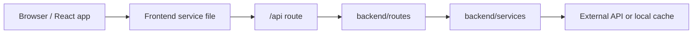

# API And Data Flow

This document explains where data comes from and how each request moves through the project.

## High-Level Flow



## API Origin Resolution

File: `myreactapp/src/services/backendOrigin.js`

Rules:

1. If `REACT_APP_BACKEND_URL` is set, use that.
2. On localhost, use `http://localhost:5000`.
3. On deployed Vercel, use the same origin as the frontend.

This avoids hardcoding production URLs inside each service.

## Authentication

Endpoints:

- `POST /api/auth/register`
- `POST /api/auth/login`
- `GET /api/auth/session`
- `POST /api/auth/logout`
- `GET /api/auth/status`

Flow:

1. Login page calls `myreactapp/src/services/authService.js`.
2. Request reaches `backend/routes/auth.js`.
3. Route calls `backend/services/authService.js`.
4. Passwords are hashed and verified on the server.
5. Server sends an HttpOnly session cookie.

Important behavior:

- Browser JavaScript cannot read the session cookie.
- `SESSION_SECRET` signs session tokens.
- Registered users are stored in local JSON storage during local development.
- Vercel file storage is temporary, so registered users may not persist forever across serverless resets. An encrypted HttpOnly recovery cookie improves same-browser continuity, but it is not a permanent account database.

## Crop Prices

Endpoint:

- `GET /api/prices`
- `GET /api/prices/status`

Flow:

1. Crop prices page calls `myreactapp/src/services/priceService.js`.
2. Backend route `backend/routes/prices.js` calls `backend/services/priceService.js`.
3. Backend uses `AGMARKNET_API_KEY` to call data.gov.in.
4. Live results are normalized and cached.
5. If live data fails, the app falls back to saved live cache or reference data.

Cache intent:

- Avoid hitting the government API on every page refresh.
- Keep the UI truthful by labeling data as live, saved live, or reference.
- Refresh live data only after the configured refresh window.

Useful environment variables:

```bash
AGMARKNET_API_KEY=
PRICE_LIVE_REFRESH_MINUTES=10
PRICE_LOGIN_REFRESH_HOURS=24
PRICE_LIVE_FETCH_LIMIT=1000
PRICE_LIVE_FETCH_PAGES=5
```

## Weather

Endpoints:

- `GET /api/weather/current?city=Delhi`
- `GET /api/weather/current?lat=28.6&lon=77.2`
- `GET /api/weather/forecast?city=Delhi`
- `GET /api/weather/forecast?lat=28.6&lon=77.2`
- `GET /api/weather/air-quality?lat=28.6&lon=77.2`
- `GET /api/weather/precipitation?lat=28.6&lon=77.2`

Flow:

1. Weather page calls `myreactapp/src/services/weatherService.js`.
2. Frontend calls the backend proxy.
3. Backend service `backend/services/weatherService.js` calls OpenWeather using `OPENWEATHER_API_KEY`.
4. Rainfall history comes from Open-Meteo and does not need an API key.

Security rule:

- Do not put OpenWeather keys in frontend `REACT_APP_*` variables.
- The browser should call only the backend proxy.

## Chatbot

Endpoint:

- `POST /api/chat`

Flow:

1. Chatbot component calls `myreactapp/src/services/chatService.js`.
2. Backend route `backend/routes/chat.js` checks the signed-in session.
3. Backend service `backend/services/mlService.js` calls Gemini.
4. If Gemini is unavailable and `AI_LOCAL_FALLBACK=true`, the backend returns a limited local fallback answer.

Useful environment variables:

```bash
GEMINI_API_KEY=
AI_LOCAL_FALLBACK=true
```

## Government Schemes

Frontend-only dataset:

- `myreactapp/src/services/schemeService.js`

Backend review endpoints:

- `GET /api/schemes/review-log`
- `POST /api/schemes/check-links`

Flow:

1. Scheme list reads the reviewed local dataset.
2. Review endpoints can check source links and store a review log.
3. The UI shows review dates so users know the dataset is a reference directory, not an official real-time government database.

## Vercel Routing

There are explicit route files for important endpoints because Vercel routing can differ depending on project root settings.

Examples:

- `api/auth/login.js`
- `api/prices.js`
- `api/weather/[...path].js`
- `myreactapp/api/auth/login.js`
- `myreactapp/api/weather/[...path].js`

Most of these files are thin wrappers. Keep business logic in `backend/`.
